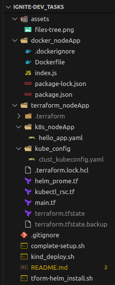

# ignite.dev_tasks

This repo contains implementation for the ignite.dev devops intern evaluation task. The implementations there-in include the following:

* Dockerizing a simple hello world nodejs app

* Creating a KinD k8s clutser and etracting the kube config file

* Deploying the nodejs application and, the kube-prometheus-stack (for monitoring the KinD cluster) to Kubernetes the KinD k8s cluster using terraform

### Project File & Directory Tree

Below is a snapshot of files and directories tree structure of the project.

### Project setup

run complete-setup.sh script to completely setup this project.

## Note:

> for security reasons, I did not push/commit the KinD cluster's kubeconfig file
> However, when the .complete-setup.sh script is ran to conclusion, a kubeconfig file will be generated and saved in the *terraform_nodeApp/kube_config/clust_kubeconfig.yaml* relative path on your server.  
